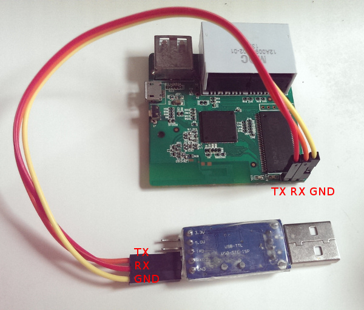
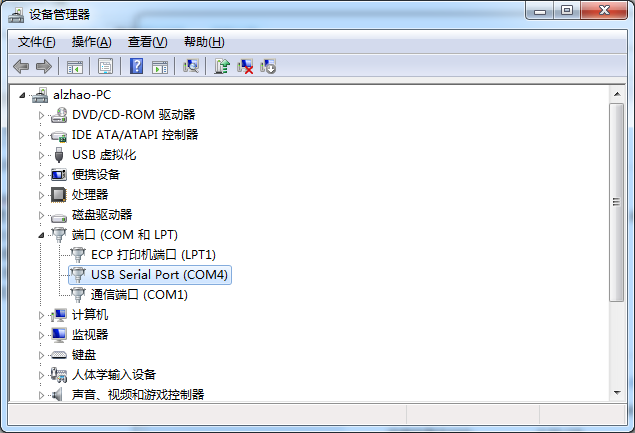
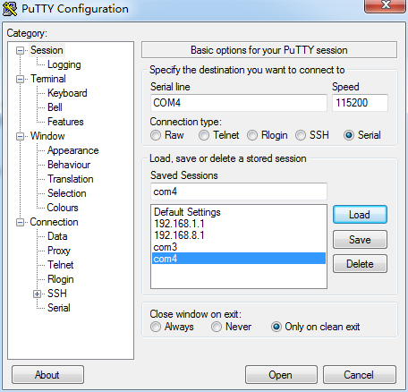
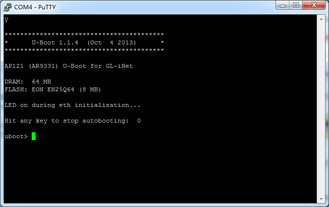

Connection UART serial
===================

Connections
----------

Serial pins are the most used pins for DIY users. You can connect to a <a href="http://www.ebay.com/itm/PL-2303-USB-to-UART-TTL-adapter-/321407483336">USB UART</a> adapter as in the picture.



Linux (ubuntu)/MAC
------------
In Linux or OSX, when you plug the USB UART adapter to your computer, the driver should already be installed. Check if you have device registered.
```
$ls /dev/ttyUSB*
/dev/ttyUSB0
```
you need to have kermit to connect to serial.
```
$sudo apt-get install gkermit
```

Then you need to make the configuration file for kermit: ~/.kermrc. The content should be:
```
set line /dev/ttyUSB0
set speed 115200
set carrier-watch off
set handshake none
set flow-control none
robust
set file type bin
set file name lit
set rec pack 1000
set send pack 1000
set window 5
```

Now connect to the device using root:
```
$sudo kermit -c
Connecting to /dev/ttyUSB0, speed 115200
 Escape character: Ctrl-\ (ASCII 28, FS): enabled
Type the escape character followed by C to get back,
or followed by ? to see other options.
----------------------------------------------------

```

When you have finished, press `Ctrl-\` then `c` to quit kermit.

Windows
---------
When connecting the USB UART adapter to your computer, you may need to install drivers for them. The drivers can be download here: somewhere.

Now you will be able to find the serial COM port (in this example: `COM4`) in device manger.



Install a terminal software. <a href="http://www.chiark.greenend.org.uk/~sgtatham/putty/download.html">putty</a> is recommended. You need to set COM port `COM4`, speed `115200` and connection type `Serial`. Click "Open".




You will be displayed a black window. If you turn on your device now, you will see the console output of the box.




Dual Serial connection on Domino Pi
-------------------------------
Domino Pi has dual serial connection, please refer to <a href='http://domino.io/#!domino/pi/serial.md'>Domino Pi Serial</a> for details.

## Discussions
