# Connect the mini router to the Internet

Cable, Repeater, Modem and Tethering

Note: Most of the pictures in this instructions are for firmware v2.20. Firmware v2.22 may has slightly different interfaces.

## Status

The main UI shows the Internet status, mainly the IP address and protol in the setting area. The data will refresh every several seconds.

You can click the `Internet part` in the Settings bar, you will have tools to change Internet settings.

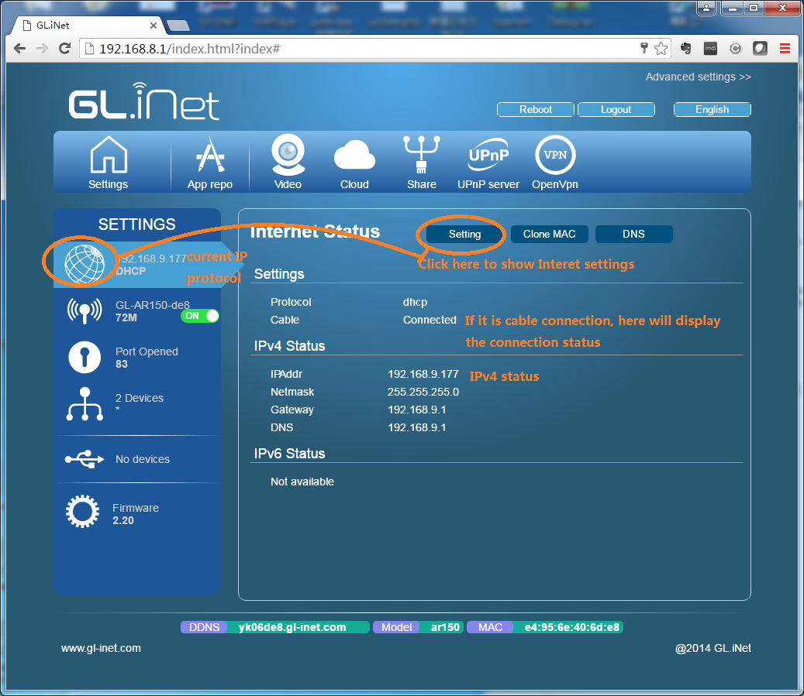

You can now click "Setting" button or the Internet Icon to pop up Internet settings page.

## DHCP

**DHCP requires you to connect using Internet cable.**

Your main router or ISP should be able to provide such option.

DHCP is the default and most common method to connect to the Internet. You just need to choose `DHCP` and click `Submit`.

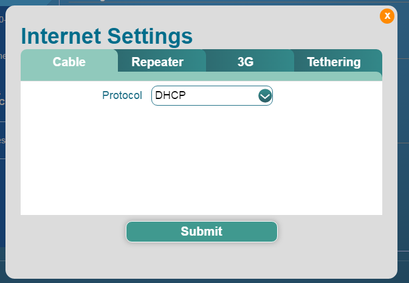

## Static

**Static requires you to connect using Internet cable.**

`Static` is required if you want your router have a fixed IP address given by your ISP or in the same subnet of your main router.

The current settings will be automactically filled in the filed. Change it according to your needs, then click `Submit`.

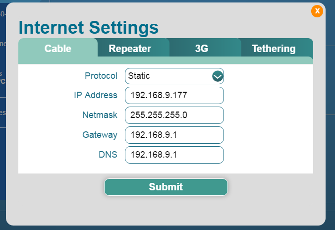

## PPPoE

`PPPoE` is required by many ISP. Generally they will give you a modem and provide you a username and password.

Fill your `username` and `password` then click `Submit`.

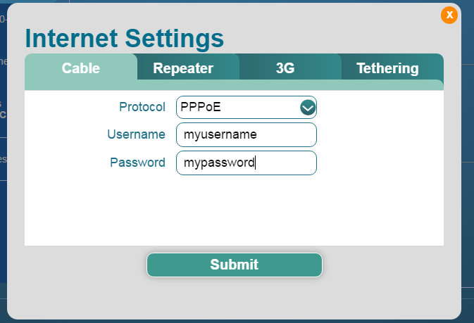

## Repeater (WISP)

Note: **Please check the [Repeater Manager function](../mini/repeater_manager.md)**

Using GLi mini routers, you don't need to have an Ethernet cable to surf the Internet, you can user it as repeater. The most common one is WISP (Wireless Internet Service Provider).

In WISP mode, the mini router act as a firewall and protect you from outside. If you are using a public wifi, you need to use this mode.

In the following diagram, your main router has an IP 192.168.1.1. Suppose its netmask is 255.255.255.0, your mini router will have two IP address:

`192.168.1.99` which is got from your main router

`192.168.8.1` which is created by itself

So all your devices connected to the mini router will be protected by the firewall.

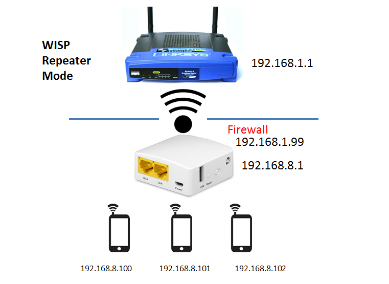

First Click `Repeater` tab in `Internet Settings`, the router will search for the available SSIDs around automatically. Then choose the one your want to repeat and type your password. The `Mode` should be `WISP`, then click `Submit`.

## Repeater Bridge (WDS)

In other circumstances, you want to connect to your own router which you trust. You don't need a separate network, you can use Repeater Bridge mode. The most common one is called `WDS`. To use this mode, **your main router has to support WDS**. Consult your main router's manual to check if it has this options.

In WDS mode, the mini router only boost your main router's signal area, not creating a seprate network. There is no firewall between the mini router and the main router.

**OpenVPN client function of the mini router will not work in bridge mode**

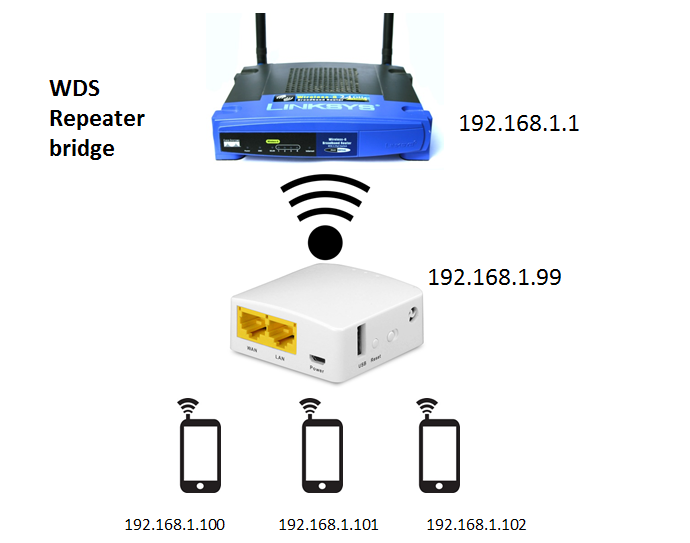

To use WDS repeater, **ensure your main router support WDS**, then choose `WDS` from mode list. You will have an option to input a static IP, which will be used to access this mini router.

If you know the subnet of your main router, for example in this case it is `192.168.1.x`, you can input a static IP, e.g. `192.168.1.99`. This static IP should not conflict with any other devices' IP address. Then later you should access this UI at `http://192.168.1.99`

If you are not sure, just keep the IP address blank so that it will get a IP address from your main router automatically. But you need to find out this IP in your main router's admin UI if you want to access this UI again.

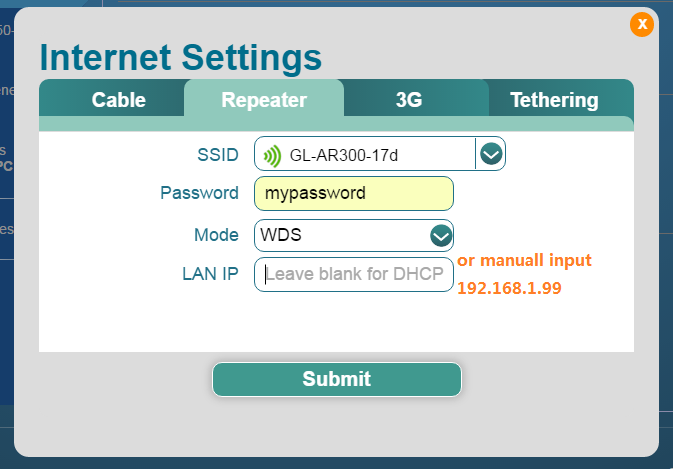

## Repeater Bridge (relayd)

In case you are having an old router and it doesn't support WDS, you can use WISP mode then setup a relayd overlay.

Here is [detailed instructions](src/relayd.pdf) of how to do it.

**OpenVPN client function of the mini router will not work in bridge mode**

## 3G/4G Modem

Using the mini router, you can connect to the Internet using 3G or 4G modems. Click the `3G` tab to enter the UI.

The basic mode we only have limted data. We recommend you to use the advanced method by clicking the `Advanced Setup >>>`.

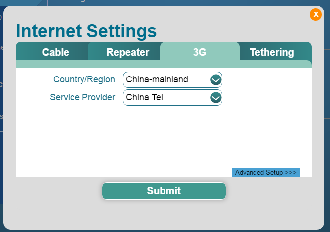

After you plug in your modem, you will see the device in Modem Device list. There maybe several devices and you need to try different devices. Most devices are ttyUSB2. In my case it is ttyUSB1.

**Some new modem models works like Ethernet devices and you need to use Tethering.** Please check next section for this.

You need to choose the appropriate `Service Type`. Consult your ISP for this.

Most importantly you need to type the `APN`, in my case it is 3gnet.

Now click `Submit`.

**If you used the wrong ttyUSB device, you need to try another one. Some modems needs you to unplug it first and plug in again**

###Compatible 3G, 4G LTE modem List

With Standard OpenWrt CC1505 distribution installed, the mini router support hundreds of 3G 4G dongles on the market. However we cannot test all these models.

Here is a list of supported modems we tested:

| Model          | 3G/4G | Tested | Tested by       | Comments |
|----------------|-------|--------|-----------------|----------|
| Quectel EC20-E | 4G    | Yes    | GLi             |          |
| Quectel EC20-C | 4G    | Yes    | GLi             |          |
| Quectel UC20-E | 3G    | Yes    | GLi             |          |
| ZTE ME909s-821 | 4G    | Yes    | GLi             |          |
| Huawei E1550   | 3G    | Yes    | GLi             |          |
| Huanwei E3276  | 4G    | Yes    | GLi             |          |
| TP-Link MA260  | 3G    | Yes    | GLi             |          |
| ZTE M823       | 4G    | Yes    | Arnas Risqianto |          |
| ZTE MF190      | 3G    | Yes    | Arnas Risqianto |          |
| Huawei E3372   | 4G    | Yes    | anonymous       |          |
|                |       |        |                 |          |

You can also refer to [http://ofmodemsandmen.com/supported.html](http://ofmodemsandmen.com/supported.html) for a well supported modem list.

Modems can be Regular USB or Host-less versions. If it is host-less, it will work as tethering.

## Phone (modem) Tethering

You can also tether your smartphone's data to the router. Some new 3G/4G modems work as this mode as well. Plug your phone to the mini router's USB port.

Note: The stock firmware support iPhone and most Android phones. You have to enable "Tethering" or Sharing in your phone.

Note: For iPhone, the first time you connect your phone to the router, you phone will ask if you would like to `Trust` the computer it connected to. Please click `Trust`.

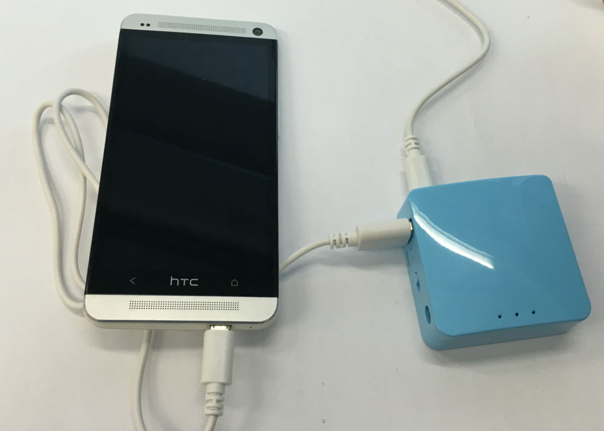

Then click `Tethering` tab. Your smartphone will appear as a network devices, with names: `eth1 eth2 usb0` etc. depends on the model.

## Clone MAC

Clone MAC is used especially in hotels, hotspot etc when the server checks your mac address. For example, if you got your smartphone registered on the network, you can clone your smartphone's mac address to the router so that the router can connect.

Clieck the `Clone Mac` button and you will have the following interface.

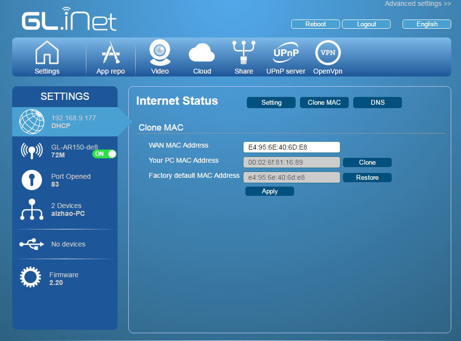

Your current mac address will be displayed in `WAN MAC Address`. You can click `Clone` to copy your device's mac address or click `Restore` to restore the factory set mac.

Don't forget clicking `Apply` and wait some seconds for it to take effect.

## Custom DNS

You can set up custom dns server for some purpose.

Click `DNS` button you will be able to input custom dns. You can input max two dns servers.

`Force all clients to use` will capture the dns request from all the connected client, for example Google Chrome cast. This option does not need to be used with custom DNS server.

A separate article will be written about DNS.

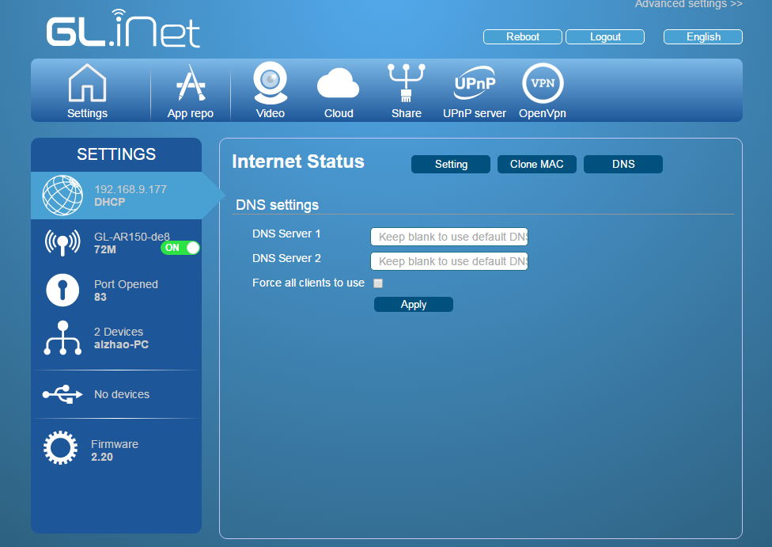

# Discussions
