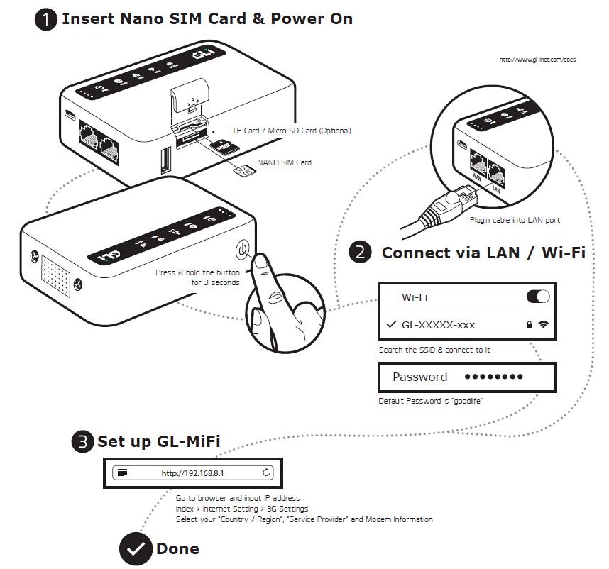
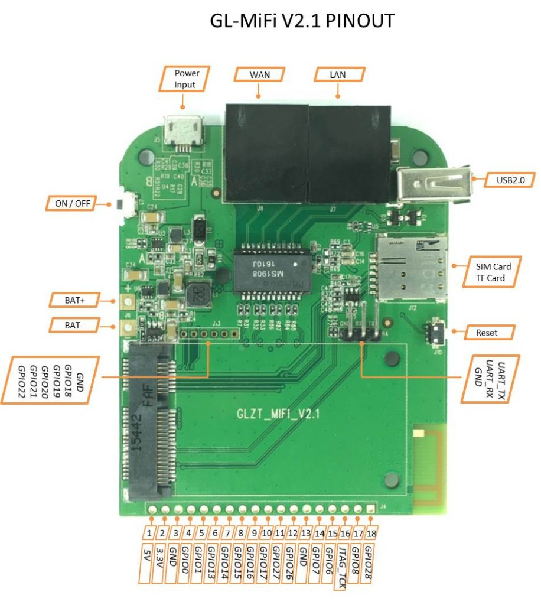
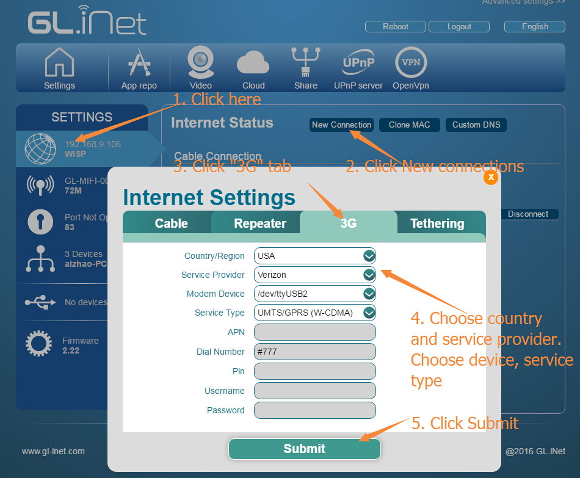

# Using GL-MiFi

Industrial grade mobile Wifi

## Choosing the correct configuration

GL-MiFi is designed for flexbility so when you [buy from our shop](https://www.gl-inet.com/product/gl-mifi/) you can choose configurations.  

The most important is that you choose the correct 3G/4G modules that works in your country. 

Generally for American, Europe and Asia the modules and bands are different. If you are not in these areas please consult your service provider for more details.

## Power it on

When you get the mifi device, You can insert your SIM card. You can also insert a MicroSD card if you want to share its content.

please connect power and press and hold the power button for 3 seconds to power the device on.

You can connect to the MiFi using an Ethernet cable or using WiFi. The default password is `goodlife`.

Now using a browser, acess [http://192.168.8.1](http://192.168.8.1) to set the device up.



## First time setup 

The User interface is the same as our other mini routers. You can consult other pages for Mini routers for setting up Internet, wifi and LAN.

## Compatible 3g/4g modules

GL-Mifi is compatible with most PCIe 3G/4G modules. We have three modules tested.

* 3G: 	Quectel UC20, 
* 4G: 	Quectel EC20, HUAWEI ME909s-821

To Check if the modules are recognized by the MiFi:

SSH to the board 192.168.1.1 or using serial, and use this command:
```
ls /dev/ttyUSB*
```

If the console displays `ttyUSB0`, `ttyUSB1`, `ttyUSB2`, `ttyUSB3` and/or `ttyUSB4` (as figure shown below), that means GL-MiFi identified the module and we can then configure the MiFi.

Check if the device is supported in QMI mode: `ls /dev/cdc-wdm0`
 

For Quectel EC20, and UC20, the port should be used as:

* `/dev/ttyUSB0`	DM
* `/dev/ttyUSB1`	GPS NMEA message output
* `/dev/ttyUSB2`	AT commands
* `/dev/ttyUSB3`	PPP connection or AT commands
* `wwan0` (QMI mode)	USB network adapter

For Huawei ME909s-821, the data port is `/dev/ttyUSB0`

| Name              | Data Port    | AT Command Port |
|-------------------|--------------|-----------------|
| Quectel EC20      | /dev/ttyUSB3 | /dev/ttyUSB2    |
| Quectel UC20      | /dev/ttyUSB3 | /dev/ttyUSB2    |
| Huawei ME909s-821 | /dev/ttyUSB0 |                 |
| Huawei EM770      | /dev/ttyUSB2 | /dev/ttyUSB0    |


## GPIOs

MiFi expose all the spare GPIOs of AR9331 so it is good for IoT projects. Please check the picture below for GPIO numbers.



## Setting up Internet

If you want to connect to the Internet using 3G/4G,
1. Click "Internet" area
2. Click "New connections" 
3. Click "3G" tab
4. First, choose region and then choose service provider. The UI will fill the gray field automatically.
5. Please choose the correct device. Consult the above sections for details.
6. Please choose correct service type, UMTS or EVDO
7. If the gray field contains wrong information, e.g. wrong apn, please edit the field and report to us.
8. Click "Submit" button



In Internet status windows it will show the status of 3G/4G connection.

There are two buttons what you can use in case you have problems with the device.

* Reset: This will hard reset the modem, which means the modem (not the device) will power off and on again. This takes 40 seconds to 1 minutes. Be patient and wait for the modem to get connected. You need to reset the modem in case the modem encounter problems or your insert the SIM card after the device boot or change SIM card.
* Disconnect: This will just disconnect the modem network, but it will not diconnect the modem power.


## AT commands

For UC20/EC20, /dev/ttyUSB2 is for AT commands. First send the commands to the port, then get the output from the port. For example:
```
echo -e "AT+xxx \r\n" > /dev/ttyUSB2
cat /dev/ttyUSB2
```

### Comgt – a quick tool
There is a build-in tool called “comgt” which you can quickly check if you SIM card is registered or not. This should give the correct output before you set up the apn and start network connection.
```
root@dominomifi:/# comgt 
Trying list of devices
SIM ready
Waiting for Registration..(120 sec max)
Registered on Home network: "one2free",6
Signal Quality: 14,99
```

### Request International Mobile Equipment Identity
```
echo -e "AT+GSN\r\n" > /dev/ttyUSB2
cat /dev/ttyUSB2
```
Correct result: 
```
AT+GSN
861075021617089
OK
```
If you get the similar number, it means that the connection is OK.
```
Wrong result:
AT+GSN
ERROR
```

### Request SIM’S CCID
```
echo -e "AT+QCCID\r\n" > /dev/ttyUSB2
cat /dev/ttyUSB2
```
Correct result:
```
AT+QCCID
+QCCID: 89860115851079757018
OK
```
If you get the similar number, it means that the connection of SIM-card is OK.
```
Wrong result:
AT+CCIDI
ERROR
```

### Request IMSI
```
echo -e "AT+CIMI\r\n" > /dev/ttyUSB2
cat /dev/ttyUSB2
```
Correct result:
```
AT+CIMI 
460010529708870
OK
```
Wrong result:
```
AT+CIMI
ERROR
```

### Check Network Registration
```
echo -e "AT+CREG?\r\n" > /dev/ttyUSB2
cat /dev/ttyUSB2
```
Correct result:
```
AT+CREG?
+CREG: 0,1
OK 
```
If you get the similar result, it means that your SIM-card has registered in telecom operators

Wrong result:
```
AT+CREG? 
ERROR
```
### Signal Quality Report
```
echo -e "AT+CSQ \r\n" > /dev/ttyUSB2
cat /dev/ttyUSB2
```
Correct result:
```
 +CSQ: 21,99
OK 
```
This first number—“21” is the result. We usually get the value number is 18~23.

Wrong result:
```
AT+CSQ 
ERROR
```

### Query The Currently Selected Network Operator
```
echo -e "AT+COPS?\r\n" > /dev/ttyUSB2
cat /dev/ttyUSB2
```
Correct result:
```
AT+COPS?
+COPS: 0,0,"CHN-UNICOM",6
OK
```
The currently network operator is ChinaUnicom

Wrong result:
```
AT+COPS? 
ERROR
```

### Choose network mode

set modem to only LTE 
```
echo -e "AT+QCFG=\"nwscanmode\",3,1" > /dev/ttyUSB2 
```
set back to auto
```
echo -e "AT+QCFG=\"nwscanmode\",0,1" > /dev/ttyUSB2
```

### Reset
You can reset the modem using AT command. The modem will be disconnected and connected again.
```
echo -e “AT+QRST=1,0” > /dev/ttyUSB2
```

### GPS Location
This only applies to Quectel UC20 3g module, which has GPS built in.

Initialization Command:
```
echo -e "AT+QGPSCFG=\"outport\",\"usbnmea\" \r\n" > /dev/ttyUSB2  
echo -e "AT+QGPSCFG=\"nmeasrc\",1 \r\n" > /dev/ttyUSB2
echo -e "AT+QGPSCFG=\"gpsnmeatype\",1 \r\n" > /dev/ttyUSB2
echo -e "AT+QGPSCFG=\"glonassnmeatype\",4 \r\n" > /dev/ttyUSB2
echo -e "AT+QGPSCFG=\"glonassenable\",0 \r\n" > /dev/ttyUSB2
echo -e "AT+QGPSCFG=\"odpcontrol\",0 \r\n" > /dev/ttyUSB2
echo -e "AT+QGPSCFG=\"dpoenable\",0 \r\n" > /dev/ttyUSB2
echo -e "AT+QGPS=1 \r\n" > /dev/ttyUSB2
```
Location Command:
```
echo -e "AT+QGPSLOC? \r\n" > /dev/ttyUSB2
cat  /dev/ttyUSB2 
```
Module Closure:
```
echo -e "AT+QGPSEND \r\n" > /dev/ttyUSB2
```

If you want to know more, please refer Quectel_UC20_AT_Commands_Manual_V1.5.pdf which you should be able to download if you bought GL-MiFi.

## Working with QMI mode

Note: QMI mode is supprted from firmware v2.23-6.

If the firmware is commpiled with QMI driver, you will find  `/dev/cdc-wdm0` in the Linux system.

For unknown reason, UC20 seems not work in this mode.

### Settings 

From firmware V2.23-6, EC20 is always using QMI mode when you config it in the UI. If you want to configure manually, check `/etc/config/network`

```
config interface 'modem'
	option proto 'wwan'
	option ifname 'wwan0'
    ...
```
You need to do a network restart 
```
/etc/init.d/network retart
```
### Tools

Check connection status
```
root@OpenWrt:~# uqmi -d /dev/cdc-wdm0 --get-data-status
"disconnected"
```
Get signal info
```
root@OpenWrt:~# uqmi -d /dev/cdc-wdm0 --get-signal-info
{
        "type": "lte",
        "rssi": -71,
        "rsrq": -9,
        "rsrp": -94,
        "snr": 70
}
```
To start the Internet connection, replace “apn” with your real apn
```
uqmi -d /dev/cdc-wdm0 --start-network apn  --autoconnect
```

Then you will see you have wwan0 in your ifconfig
```
root@domino:/# ifconfig wwan0
wwan0     Link encap:Ethernet  HWaddr 9A:02:75:A0:CA:59  
          inet6 addr: fe80::9802:75ff:fea0:ca59/64 Scope:Link
          UP BROADCAST RUNNING MULTICAST  MTU:1500  Metric:1
          RX packets:0 errors:0 dropped:0 overruns:0 frame:0
          TX packets:254 errors:0 dropped:0 overruns:0 carrier:0
          collisions:0 txqueuelen:1000 
          RX bytes:0 (0.0 B)  TX bytes:82077 (80.1 KiB)
```
### AT commands
You can also use low level AT commands to start the Internet. 

The apn, username and password should be sent in the following format:

AT+QICSGP=1,1,"apn" [,"username","password" [,<authentication>]]]

For example, my apn is “pccw”, I am using the following command.
```
cat /dev/ttyUSB2 &
echo -en "AT+QICSGP=1,1,\"pccw\",\"\",\"\",0\r\n" > /dev/ttyUSB2
echo -en "AT+QCFG=\"rmnet/autoconnect\",1,0\r\n" > /dev/ttyUSB2
```

You need to do a RESET to make the changes take effect according to Quectel manual.
```
echo -e "AT+QRST=1,0\r\n" > /dev/ttyUSB2
```

## Compile your firmware

coming later

# Troubleshooting

**No ttyUSB0~ttyUSB4**

This generally means the driver is not installed or the module is not recognized. You may need to check the connections of the module.

**Field: [option_instat_callback: error -2] appears after startup**

For some complicated reasons:
* Bad contact of SIM Card.
* No antenna inserted.
* Wrong operator parameters.
* No network.
* Data interface (ttyUSBx) configured incorrectly.
* 
When this happens:
1. Check connection
2. Connect antennas
3. Correct network settings
4. After you have done the above, try to restart network by execute /etc/init.d/network restart . If the error still exists, try to unplug the power and plug the power again. Simply reboot the device without unplug the device may not help. 


# Discussions
