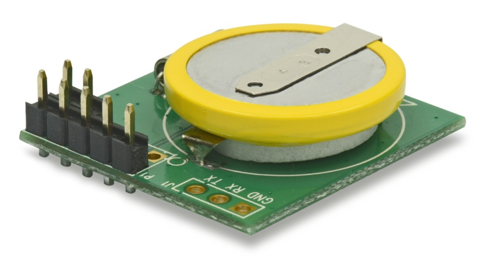
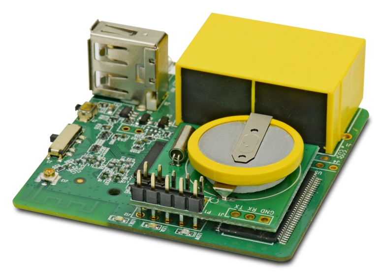
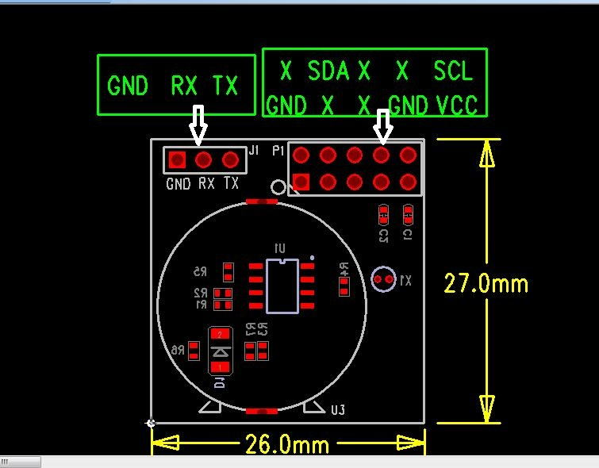

# Using RTC (Realtime control) in GL-AR150


## Install kernel modules

If you use our stock firmware, you can just install using `opkg`

```
opkg update
opkg install kmod-i2c-gpio-custom
opkg install kmod-rtc-ds1307
```

If you want to compile your own firmware, choose these packages:
```
Kernel modules  --->  I2C support  --->  kmod-i2c-gpio-custom
Device Drivers  --->  Real Time Clock  --->  Dallas/Maxim DS1307/37/38/39/40, ST M41T00, EPSON RX-8025
```

## Connection

The module should be very easy to install. You need to mount like in the picture. Most important, you need to solder `GND, VCC, SDA and SCL`.





## Software

The GPIO used for RTC is below:

`SDA` <--> `GPIO1`
`SCL` <--> `GPIO17`

Now you need in insert kernel modules and connect to the module

```
insmod /lib/modules/3.18.29/i2c-gpio-custom.ko bus0=0,1,17
echo ds1307 0x68 > /sys/bus/i2c/devices/i2c-0/new_device
```

To read the time from RTC module
```
hwclock -r
```

To sync the RTC module's time to mini router
```
hwclock -s
```

To write mini router's time to RTC module
```
hwclock -w
```

