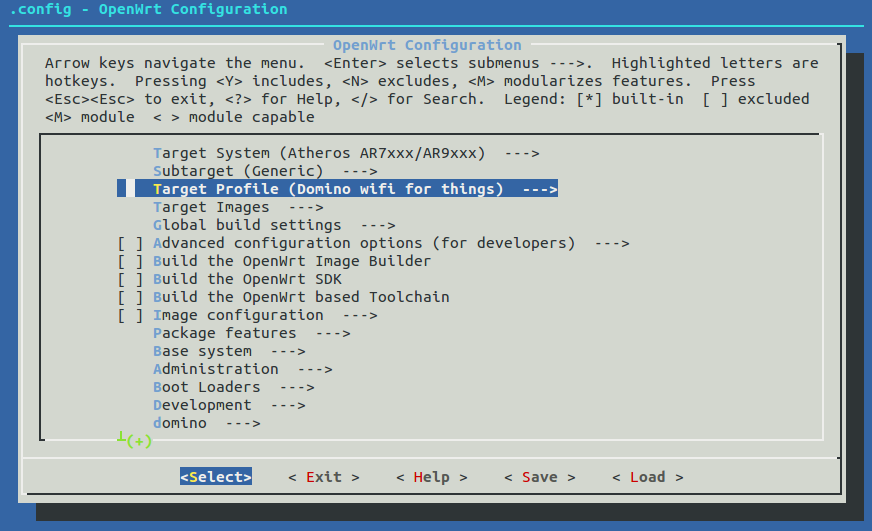

#Compile the firmware
It is not difficult to compile your own OpenWrt firmware for Domino. Follow these instructions step by step.

Build a clean Openwrt firmware for Domino
===============

OpenWrt is a Linux distribution for embedded devices. You can find all the details of OpenWrt from http://openwrt.org
To compile an OpenWrt firmware for Domino, first you need to have a Linux environment. We will use Ubuntu as an example in this guide.

###1. Build environment

First install all the necessary packages:
```
sudo apt-get update 
sudo apt-get install subversion build-essential git-core libncurses5-dev zlib1g-dev gawk flex quilt 
libssl-dev xsltproc libxml-parser-perl mercurial bzr ecj cvs unzip 
```


###2. Configure quilt
Refer to http://wiki.openwrt.org/doc/devel/patches to understand how OpenWrt deal with patches. We will need to apply a patch to OpenWrt.
=======
###2. Download OpenWrt
For Domino-Pi, we use OpenWrt release BB1407.
```
git clone git://git.openwrt.org/14.07/openwrt.git openwrt-domino
cd openwrt-domino
./scripts/feeds update -a
./scripts/feeds install -a
```

###3. Install Quilt for patches
Refer to http://wiki.openwrt.org/doc/devel/patches to understand how OpenWrt deals with patches. We will need to apply a patch to OpenWrt.

```
cat > ~/.quiltrc <<EOF
QUILT_DIFF_ARGS="--no-timestamps --no-index -p ab --color=auto"
QUILT_REFRESH_ARGS="--no-timestamps --no-index -p ab"
QUILT_PATCH_OPTS="--unified"
QUILT_DIFF_OPTS="-p"
EDITOR="nano"
EOF
```

###3. Download OpenWrt 1407
For domino-Pi, we use OpenWrt release BB1407.
```
git clone git://git.openwrt.org/14.07/openwrt.git openwrt-domino
cd openwrt-domino
./scripts/feeds update -a
./scripts/feeds install -a
```

###3-alternative. Download OpenWrt CC1505
We upgrade the code to CC1505.
```
https://github.com/domino-team/openwrt-cc.git
cd openwrt-cc
make menuconfig
```
You will find Domino in the "Target Profile". You can skip step 4 because the pateches are already installed.

###4. Download Domino sources and apply Domino Target Patch
If you are using OpenWrt BB1407 version, please apply the patches according to these instructions.

Download the Domino Target Patch from here: https://github.com/domino-team/domino-firmware/tree/master/domino-pi/openwrt-patch 
Put the patch files in openwrt-domino/patches.
```
cd ..
git clone https://github.com/domino-team/domino-firmware.git 
cd openwrt-domino
mkdir patches
cp ../domino-firmware/domino-pi/openwrt/patches/domino.patch ./patches
cp ../domino-firmware/domino-pi/openwrt/patches/series ./patches
quilt push -a
rm ./tmp/*
./scripts/feeds install -a
```
Note that if the '-f' option is not specified, when make menuconfig is run, the Domino target will not appear.

###5. Make menuconfig
Now you need to configure OpenWrt by choosing the correct target.
```
make menuconfig
```



Select "Domino Wifi for things" in the "Target Profile". Exit and save the config file. Now you are ready to build the firmware.
```
make 
```
If you want to use multithread, run `make -j x`, x is a number.
```
make -j 5
```
You will probably encounter some errors and the compiling process will exit without showing you the details. You can run `make V=s` to show the details. Sometime it may be just a problem of downloading resources.
```
make V=s
```
After make finishes, you will find the firmware in the bin folder. The correct one is: `openwrt-ar71xx-generic-domino-squashfs-sysupgrade.bin`
```
ls bin/ar71xx
```

Please note that you have built only a very basic firmware without a web UI, and with WiFi disabled. You might get flustrated that it doesn't work as you expected. Now read on to compile more packages.

Built the stock firmware with Domino configurations
===================

###Move domino sources to OpenWrt tree
If you want to build exactly the same firmware as pre-installed in Domino Pi, please copy the sources to openwrt tree, including athplay, domino-pi, iis, mpg123.
Put these packages in openwrt-domino/package/domino

```
cd openwrt-domino
mkdir package/domino
cp -a ../domino-firmware/domino-pi/audio/* package/domino
cp -a ../domino-firmware/domino-pi/domino-pi package/domino
cp -a ../domino-firmware/domino-pi/mpg123 package/domino
mkdir files
cp -a ../domino-firmware/domino-pi//root-files/* files
```


Move the files in "root-files" to the "files" folder of openwrt. This is a quick and easy way to compile your default config to openwrt.


###Make menuconfig

Type `make menuconfig`, select 'domino' on the main menu (midway down), then select the Domino specific packages. These must be selected as compiled-in (*), not modules (M).


Select the packages by pressing the space key until it shows a '*' before the package name.

=======
You will find "domino-athplay", "domino-pi" and "kmod-domino-iis" in "Domino" category. Select them all by pressing space key until it shows a * before the package. If you don't want audio, remove "domino-athplay" and "kmod-domino-iis" from the selction. If you want to play music, you also need to select "Utilities->mpg123". 
>>>>>>> origin/master

That is all. You don't need to select any other packages because they are already selected automaticly.

###compile
Now compile the firmware by typing `make`
```
make
```


