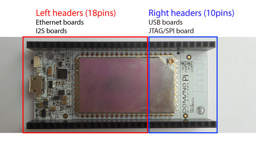
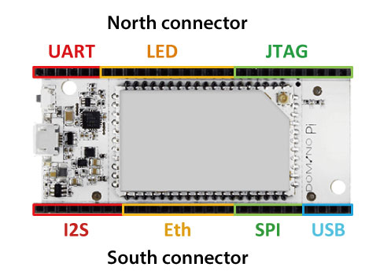
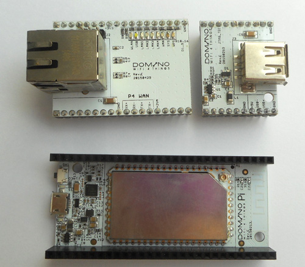
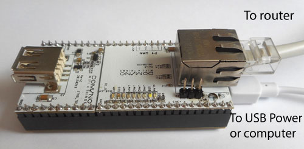

Gettting started

#Domino Pi headers

Domino Pi will always has a Domino Core mounted, when you first got your Pi, you need to understand its headers.

When placed as the picture shown, you can divide the header to left part and right part. The left part contains 18pins on each North and South connectors and the right part contains 10 pins from both North and Sourth connectors. 

The left part can be used to mount Ethernet boards (including Single Ethernet and Dual Ethernet boards) and I2S board. While the right part can be used to mount USB boards (including Single USB and 3xUSB boards) and JTAG/SPI board. Refer to the hardware section to make sure you mount the right extension boards in the right headers. Otherwise you may burn your Domino.

To give a more detailed marking of the headers, refer to this diagram.

#Assembly

Put the Ethernet and USB tile boards aligned with Domino Pi as shown, then plug the tile boards to the headers. 

Press the title board firmly to the Domino Pi board.

#Connections

Connect your Domino with an Ethernet cable to your router. Then connect power to the MicroUSB connecto on Domino Pi board and your board will be powered up!

#Using Domino Pi

When you see LEDS (WAN, WLAN) lights up, your Domino has been boot up. Now using a browser (use Firefox or Chrome) to visit [http://domino.local/](http://domino.local/), you will be able to get access the WebUi of Domino.
