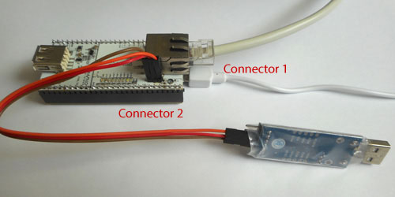
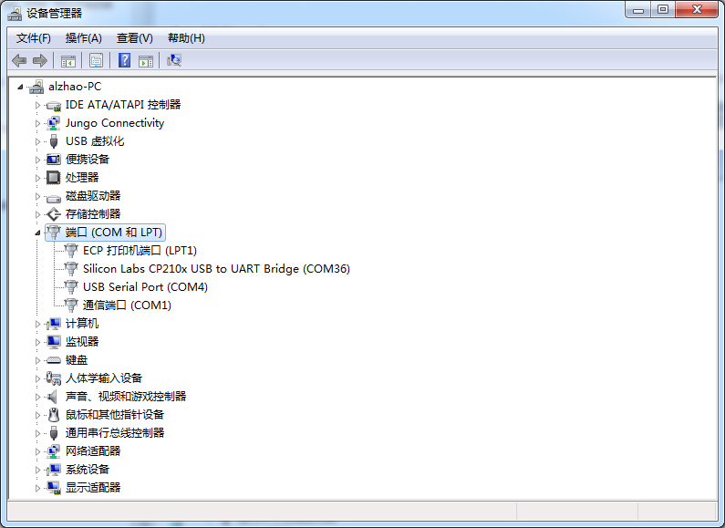
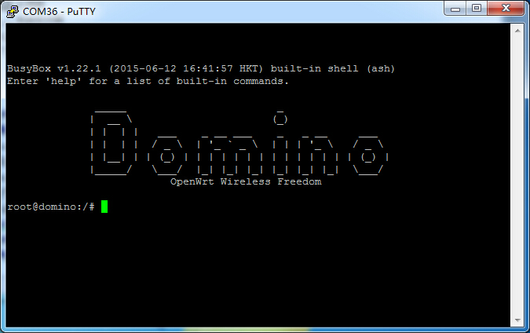
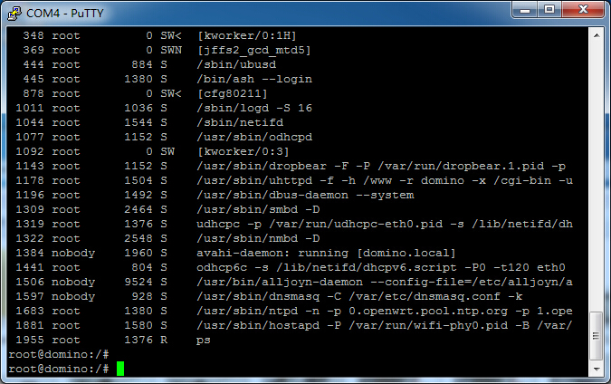
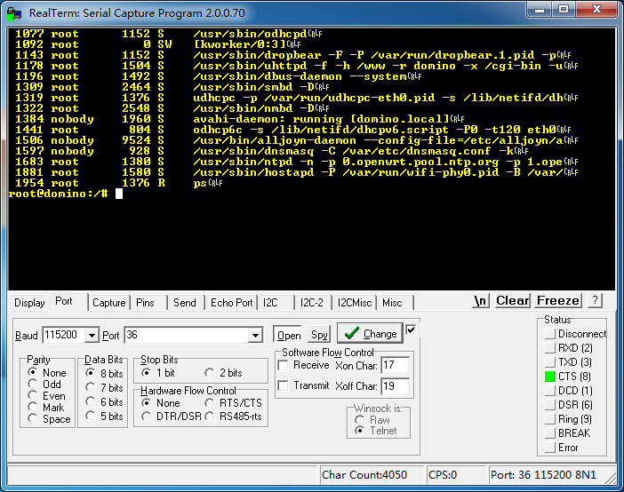
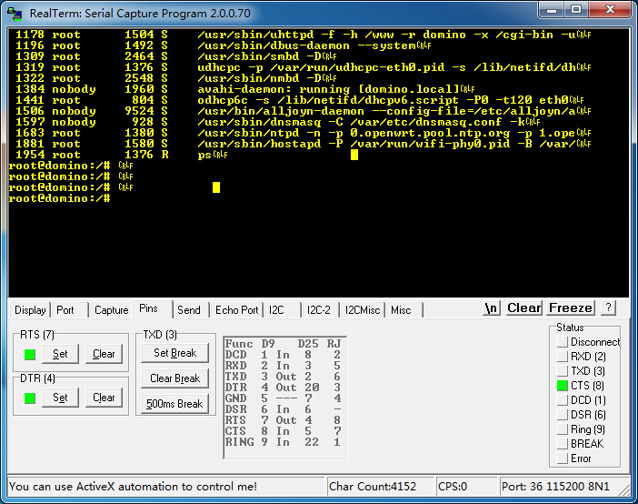

#Working with serial

It is important to have a USB-UART adapter and work with serial if you want to play with Domino. With serial, you will be able to access the console and have full controller of the OpenWrt system and bootloader.

#USB-UART adapter

Domino Pi has a build in USB-UART bridge. So you have two serial connectors, on is on the MicroUSB power connector and another is on Ethernet board, which is directly to Domino Core. 

Just connect Domino Pi to your computer, it will be powered up and at the same time you will have access to the serial.

Sometime you need to connect directly to the Domino Core UART, and you will need one USB-UART adapter.

#In Windows

If you want to use connector 1, you windows will automatically detect the USB to UART Bridge and install drivers. 

Find its com number, which is `COM36` in my case. 

If you use your own USB UART adapter, you will have an com number too, which is `COM4` in my case.

You need a serial term, we recommend [PuTTY](http://http://www.chiark.greenend.org.uk/~sgtatham/putty/download.html) and [RealTerm](http://realterm.sourceforge.net/). Download them for free.

Launch PuTTY and input `COM36` as the "Serial line", `115200` as speed, check the Connection type as `Serial`, then click `Open`. 

The press `Enter` you will enter OpenWrt.

You can also connect to `COM4` using the same way.

At the same time, you can also connect to the serial using Connector 2. Execute realterm, fill the currect Baudrate `115200`, port number `36` and click `Open`. 

**ATTENTION** Only one term can connect to one serial device at the same time.

###Working with two serials

In the above instructions, we used two terms connect to two serial ports, PuTTY connecting to Connector 2 (original uart of Domino Core) and RealTerm connecting to Connector 1 (the build in USB-UART bridge). Once you connect RealTerm, you will find that in PuTTY you cannot input anything, but you can input from RealTerm. 

You can enable input in PuTTY by clear `RTS` in RealTerm. Go to the "Pins" page and click "Clear" in RTS section, you will be able to input in PuTTY but not in RealTerm. To enable input in RealTerm again, click "Set" in RTS section.

#In Linux

(comming later)