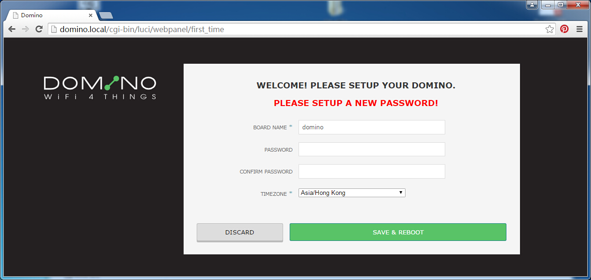
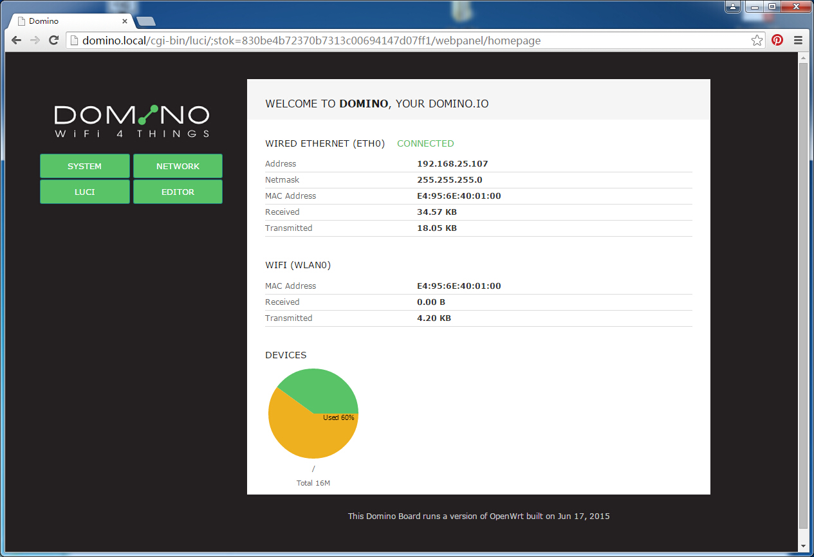
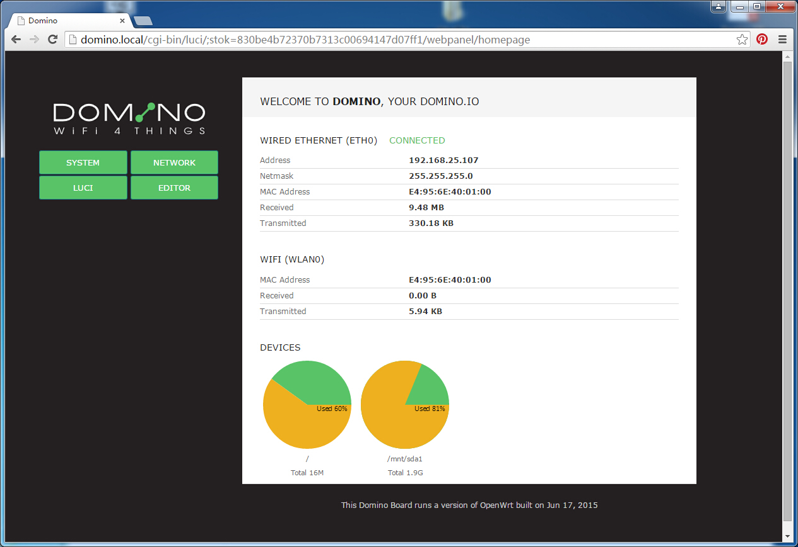

Using Domino Pi

#LED and buttons

Domino Pi board has two LEDs. The red LED is for Power, which should be always on when powered. The blue LED is for wireless (or WLAN), which will indicate the status of wireless. But it can be configured to indicate any other status of the system. 

Besides the WLAN LEDs there is a button which connects to `GPIO 11`. The function of this button can be configured by scripts. The default action is: 

1. With a short press, it will toggle the status of wifi, i.e. it will turn on/off the wifi; 
2. With a long press (10 seconds), it will revert the system to factory status.

The ethernet boards has more LEDs. For example, in the photo illustrated, the WAN led and WLAN LED is on.

#First time use

When Domino power up for the first time, it will connect to the Internet using DHCP and emit a wifi single with ssid: `Domino-xxx`, where `xxx` is the last three alphabet/digital of your MAC address. 

The default password for wifi is: `goodlife`.

The first time you use Domino, it is suggested that you connect to it directly using wifi or connect it to your router. Then using a browser (firefox or chrome) to visit `http://domino.local` to get access to it.

If you cannot find `domino.local` in your windows, you need to install `Bounjor` from Apple. Download it from https://support.apple.com/kb/DL999?locale=en_US 

The first time you use your Domino, it will ask you to setup the name and a password. Then reboot your device.

**ATTENTION**: The password is only for the embedded Linux system, not your wifi. If you want to change your wifi password, logon the system and change it later.

**ATTENTION**: If you change your boards name, for example to "myboard", after reboot, you will need to use http://myboard.local to find it.

**Hint**: If you don't want to have a reboot, just go to luci (the url is: http://domino.local/cgi-bin/luci) and set up a password, you will be able to prompt with a login page.

#The Homepage

After login, you will have a clean homepage, displaying the status of network and USB devices. You have links on the left side to vairous pages of Domino WebUI.

You will also have pie chart displaying your flash usuage.

#Network settings

###Connect to the Internet

The default protocol for WAN is `DHCP`, but you can change it according to your needs. You have 5 choices, including `DHCP, Static, PPPoE, 3G, Tethering and WiFi`. The `3g` protocol let you connect domino to the Internet via a USB 3g/4g modem. The `Tethering` protocol let you connect Domino to the Internet via an Android phone. The `WiFi` choice let you connect your Domino to an AP (e.g. router) wirelessly.

###Change Wifi and LAN settings

In the same page, you can also change WiFi and LAN settings. You can `enable/disable` Wifi, change the ssid, security or password. 

**ATTENTION** Turning on WiFi (AP) only affect Domino's ap signal without affecting its connection to your router as client.

**ATTENTION** The default LAN IP of Domino Pi is `192.168.1.1`. If this is your router's IP as well, please change it to another submit e.g. `192.168.240.1` in order that it can connect to the Internet succefully.

#Working with USB devices

You can connect USB devices to Domino via the USB tiles. 

If you connect a USB disk, you will find a pie chart showing its storage usage. By clicking the pi chart, you will be able to list the content of storage.

If you connect a USB webcam, you will have a live video streaming charge in your homepage. Please consult the "Live video streaming" page for more details.

#Code editor

By clicking the "Editor" link on or clicking directly the flash or USB devices on the homepage, you will be able to list the contents of flash or USB storage and edit the content of the file.

You can view or edit individual files directly. 

**ATTENTION** When editing files, your data is not encrypted.

**ATTENTION** Your Domino board have to be connected to the Internet in order to use the web editor, because the browser needs to load some big scripts to make a nice view of the code!

#LUCI

By clicking the Luci link on homepage, you will go to the LUCI webui, which is the default webui of openwrt. The webui is for advanced users and we will not explain in detail here.

At the right bottom corner of the LUCI webui, you will find a link "Domino Web Panel", click it and go back to the Domino UI.

#Securities

1. When you change your password, settings etc. your data is encrypted when trasfer on the network.

2. Wen you view or modify files using the code editor, data are NOT encrypted. 

3. When you use webcam, the default setting does NOT have a password, i.e. it is OPEN TO THE INTERNET. Everyone will be able to see you if there is no firewall. Please refer to the "Live video streaming" are for more info.

