Gettting started

#Qi Mini Interfaces

The heart of Domino Qi is Qi Mini board, which integrates Domino Core and Atmega32U4 MCU. The functions of Qi Mini is compatible with Arduino Yun.

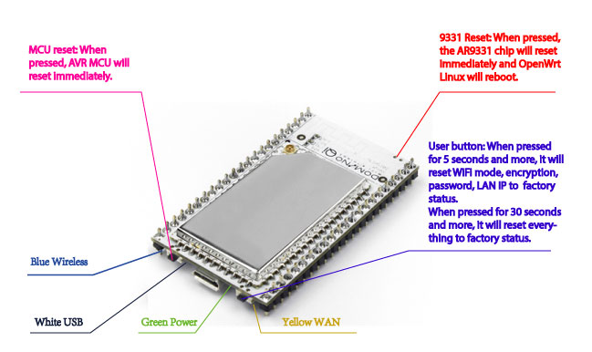

On Qi Mini, there are four LEDs:

- **Blue LED for Wireless**: when radio (ap or client) is on, it will light up.
-  **White LED for USB**: when USB is connected, it will light up. When connected to Qi baseboard, it will always on because on Qi baseboard there is a USB hub.
- **Green LED for Power**: it will always on when power is connected.
- **Yellow LED for WAN** : it will light up when Ethernet cable is connected.

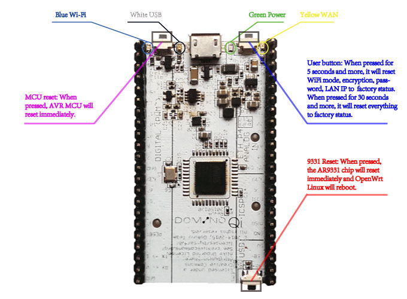

On Qi Mini, there are three buttons:

- **9331 Reset**: when pressed, it will perform a hard reset of the 9331 CPU. The OpenWrt Linux will reboot immediately.
- **MCU Reset**: when pressed, it will reset the AVR MCU immediately.
- **User Button**: This button is configured using script. The default actions are: when pressed for 5 seconds and more, it will reset WiFi mode, encryption, password, LAN IP to factory status; when pressed for 30 seconds and more, it will reset the whole system to factory default. e.g. all your change will be erased.

#Qi Assembly

The Qi Mini board use short headers. Put it onto Qi baseboard and press them firmly. On Qi baseboard, the MicroUSB is only for power and we didn't mount it by default. You can just power the kit up using the connector on Qi Mino.

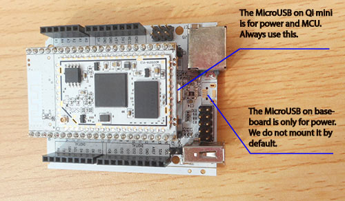

To disassemble the kit, you need a little force, as the headers are too tight. Use a pencil or plastic pen, inser into the gap between Qi Mini and the baseboard, apply a little force to lever it up. Don't be too brutal to damage the boards. Don't use a metal tools. 

#Using Qi

When using Domino Qi, you can connect the MicroUSB to you computer and connect Cable to your router. When Domino Qi is powered up, it will broadcast with SSID `Domino-xxx`, where `xxx` is the last three letters of your MAC address. If you don't use Qi baseboard, you can connect to Qi Mini via WiFi. 

The default WiFi password is `goodlife`.

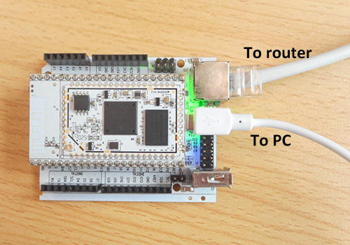

##Using the Web UI

When your Domino is up, you will find it using `http://domino.local` in your browser. 

If you cannot find domino.local in your windows, you need to install `Bounjor` from Apple. Download it from https://support.apple.com/kb/DL999?locale=en_US

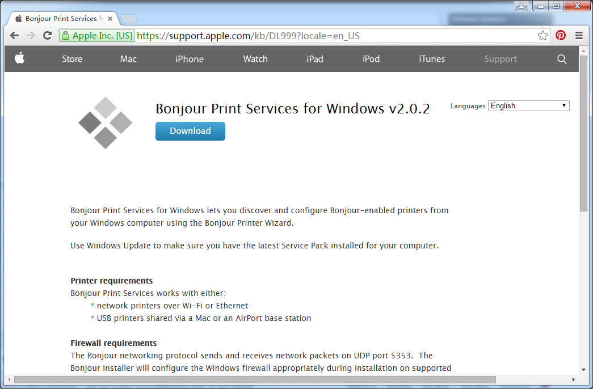

###First time settings

The first time you use your Domino, it will ask you to setup the name and a password. Then reboot your device.

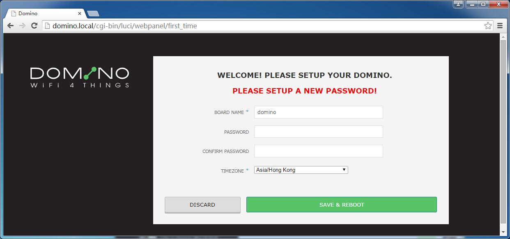

ATTENTION: The password is only for the embedded Linux system, not your wifi. If you want to change your wifi password, logon the system and change it later.ATTENTION: If you change your boards name, for example to “myboard”, after reboot, you will need to use http://myboard.local to find it.Hint: If you don’t want to have a reboot, just go to luci (the url is: http://domino.local/cgi-bin/luci) and set up a password, you will be able to prompt with a login page.

###The homepage

After login, you will have a clean homepage, displaying the status of network and USB devices. You have links on the left side to vairous pages of Domino WebUI.You will also have pie chart displaying your flash usuage. On the bottom, you can upload your sketch to your AVR. 

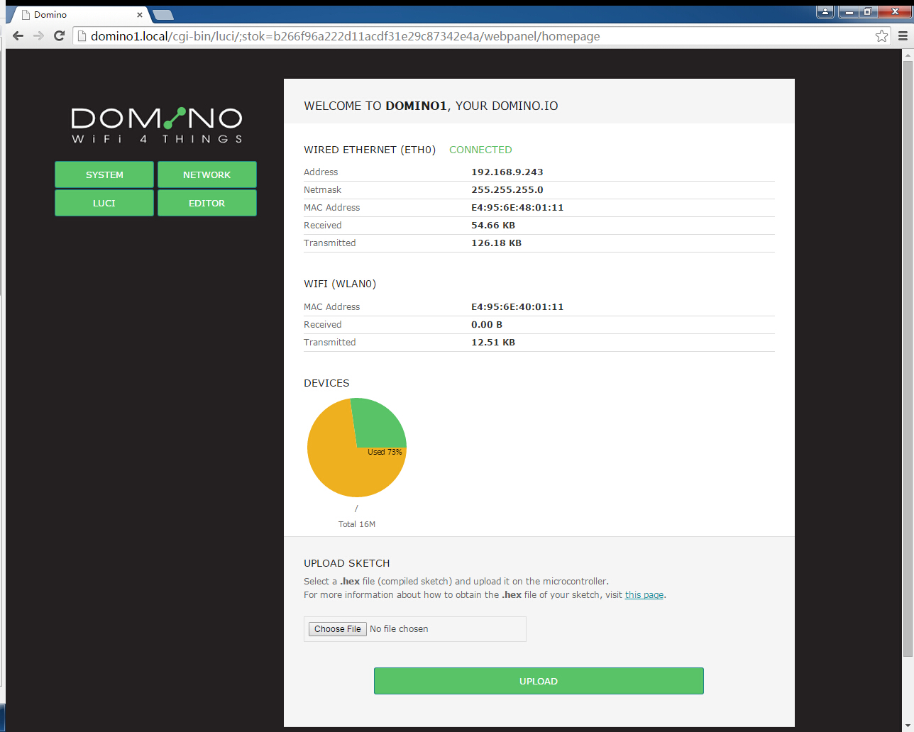

###Network settings

**Connect to the Internet**

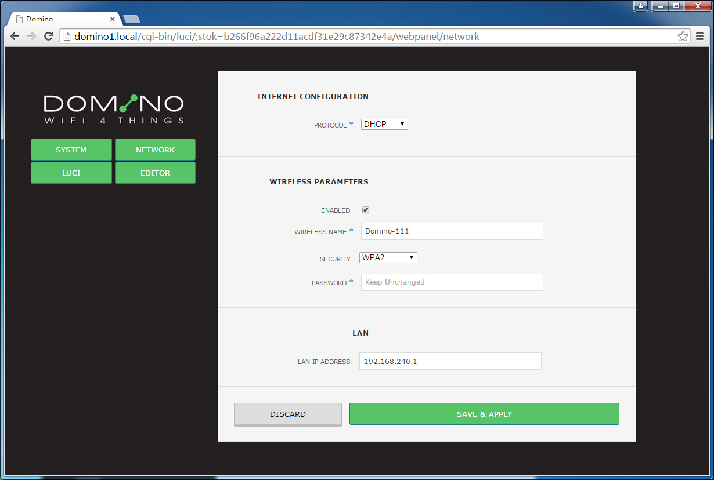

The default protocol for WAN is DHCP, but you can change it according to your needs. You have 5 choices, including DHCP, Static, PPPoE, 3G, Tethering and WiFi. The 3g protocol let you connect domino to the Internet via a USB 3g/4g modem. The Tethering protocol let you connect Domino to the Internet via an Android phone. The WiFi choice let you connect your Domino to an AP (e.g. router) wirelessly.

**Change Wifi and LAN settings**

In the same page, you can also change WiFi and LAN settings. You can `enable/disable` Wifi, change the ssid, security or password. ATTENTION Turning on WiFi (AP) only affect Domino’s ap signal without affecting its connection to your router as client.ATTENTION The default LAN IP of Domino Pi is `192.168.240.1`. If this is your router’s IP as well, please change it to another submit e.g. 192.168.44.1 in order that it can connect to the Internet succefully.

###Working with USB devices

You can connect USB devices to Domino via the USB tiles. 

If you connect a USB disk, you will find a pie chart showing its storage usage. By clicking the pi chart, you will be able to list the content of storage.

If you connect a USB webcam, you will have a live video streaming charge in your homepage. Please consult the "Live video streaming" page for more details.

###Code editor

By clicking the "Editor" link on or clicking directly the flash or USB devices on the homepage, you will be able to list the contents of flash or USB storage and edit the content of the file.

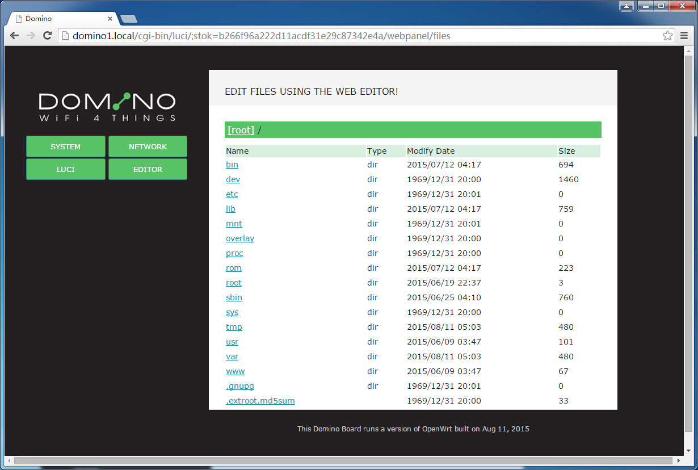

You can view or edit individual files directly. 

**ATTENTION** When editing files, your data is not encrypted.

**ATTENTION** Your Domino board have to be connected to the Internet in order to use the web editor, because the browser needs to load some big scripts to make a nice view of the code!

###LUCI

By clicking the Luci link on homepage, you will go to the LUCI webui, which is the default webui of openwrt. The webui is for advanced users and we will not explain in detail here.

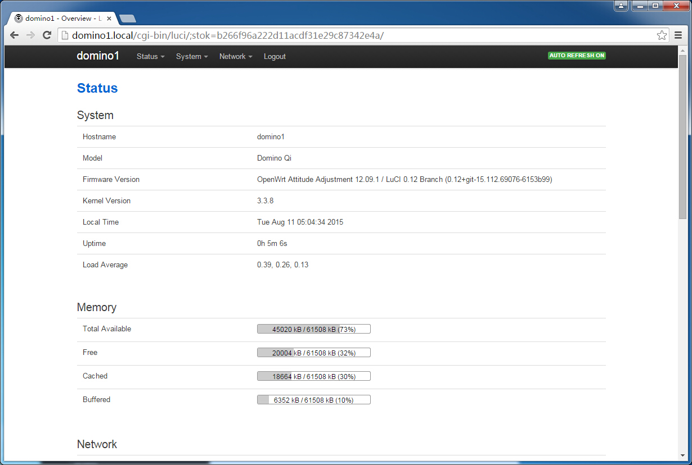

At the right bottom corner of the LUCI webui, you will find a link "Domino Web Panel", click it and go back to the Domino UI.

###Securities

1. When you change your password, settings etc. your data is encrypted when trasfer on the network.

2. Wen you view or modify files using the code editor, data are NOT encrypted. 

3. When you use webcam, the default setting does NOT have a password, i.e. it is OPEN TO THE INTERNET. Everyone will be able to see you if there is no firewall. Please refer to the "Live video streaming" are for more info.

#Using Arduino

Domino Qi uses code from Arduino, so it identify itself as Arduino Yun. When connected the MicroUSB to your computer, you will find the device in your system.

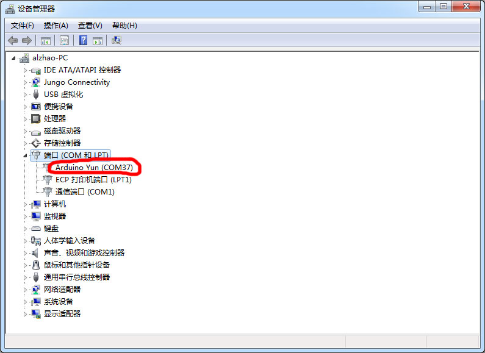

When you use Arduino IDE, you can also find your Domino board automatically. You will find two devices, one is via USB, i.e. COM37. Another is via WiFi. You can select either one and download sketch to your Domino Directly.

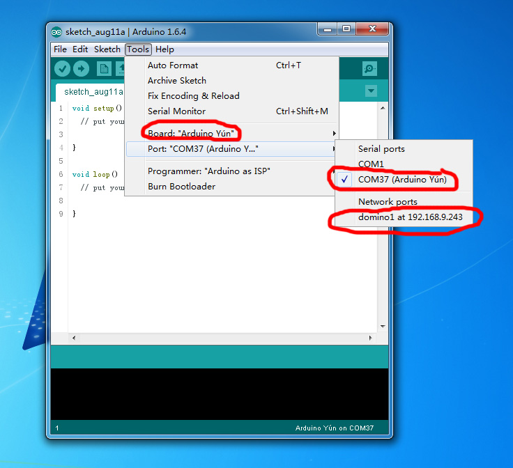
